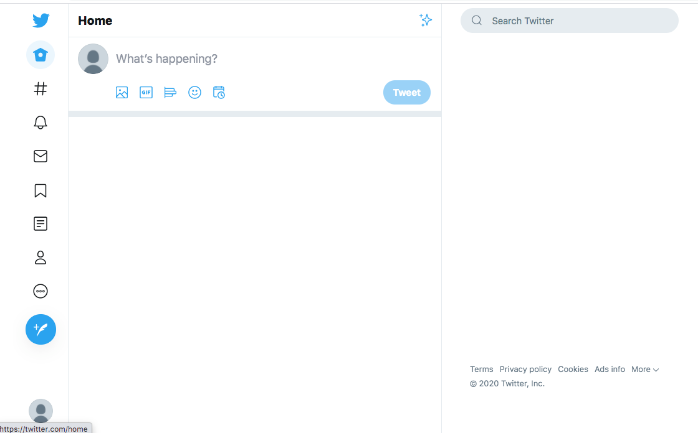
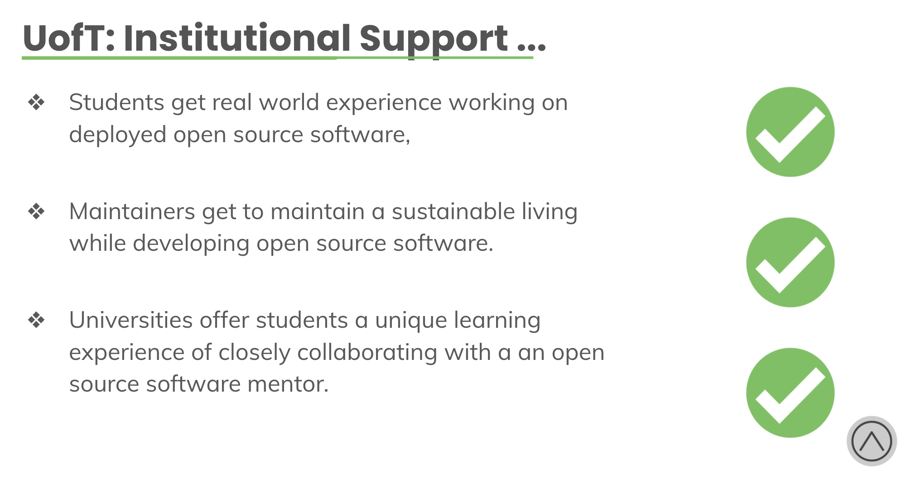

# This week in Grey Software 2020-08-03

This week, we officially submitted our articles of incorporation, launched a blog on our website, and began drawing up slides for collaboration models with other organizations. 

## 🖼️ Big Picture Org Stuff

Grey Software officially submitted it's not-for-profit articles of incorporation in Canada under the name **_Canada's Grey Software_**. 

With this, we're able to setup a bank account for the org and connect our Paypal and Stripe accounts to start receiving money from donations and software purchases.  

## 🐦 The birth of Twitter Focus

Our web dev portfolio student [Avi](https://github.com/daveavi) built the first prototype of [Twitter Focus](https://github.com/grey-software/Twitter-Focus), a web extension that allows you to hide the feed and What's Happening panel on Twitter so you can focus and control your experience! 

## ❕Blog on grey.software

We integrated the new content feature from Nuxt.js to build a blog on our website. You can check out the blog [here](https://www.grey.software/blog)

## 🙋FAQ

There have been many questions about what Grey Software is and what it does. As an org that's only 3 months old, we're still figuring that out, and so we started a list of frequently asked questions [here](/faq)

## 🤝Collaboration Models

We've started to draw up a number of collaboration opportunities our org has [here](https://docs.google.com/presentation/d/1RXnKm6lum-AjEJPvcLvAbc1sCITUhBJIvhwCHpmBtxo/edit?usp=sharing)

