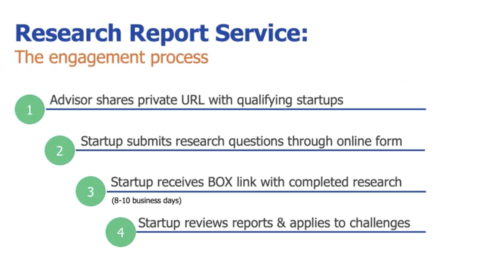

# This week in Grey Software 2020-08-24

We released major updates to our two focus extensions, and joined Ontario's
TechAlliance incubator!

## Twitter Focus Updates

Twitter focus now blocks feeds when a user navigates away and back to the
homepage. The extension now also blocks the What's Happening panel on every
page.

You can download the latest version
[here](https://chrome.google.com/webstore/detail/twitter-focus/kmdpomipbibobgdgfeidajmnlecloeml?hl=en)

## Linkedin Focus Updates

Linked in focus now blocks the newsfeed when a user navigates away and back to
the homepage.

You can download the latest version
[here](https://chrome.google.com/webstore/detail/linkedin-focus/cmafljjdkloacahjddlpaognhjpacdff?hl=en)

## TechAlliance

Grey software join southern Ontario's tech alliance incubator, .Which gives us
access to a number of neat perks, most importantly a research service from MARS
which we can use to gather important data about students' opinions on software
engineering education.
