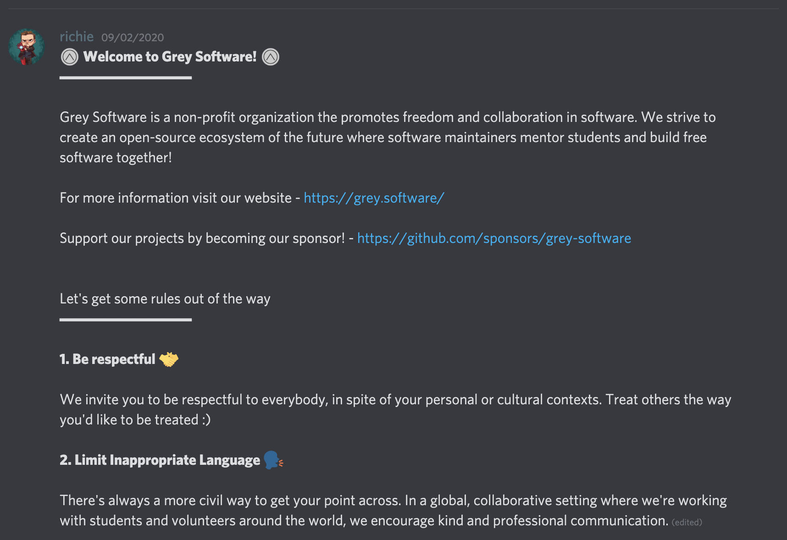
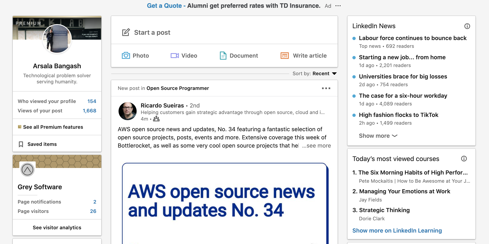
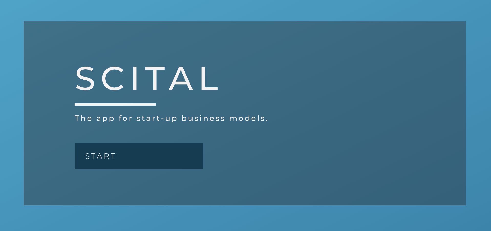

# This week in Grey Software 2020-09-07

## Discord Community Updates

We began laying the foundation for the kind of Discord community that we envision. We're keeping the community small for now, so that we can grow it steadily and maintain a healthy balance between those were seeking help and those who want help. 

[Join us on Discord](https://discord.gg/2FV8Xd)

## Sponsorware

Based on the sponsorware definition from https://github.com/sponsorware/docs, Grey Software student engineers Aaron and Osama began working on a project to allow developers an API to distribute premium versions of their software to their sponsors.

## LinkedIn Focus Bug

Isha identified a critical bug in LinkedIn Focus that has the extension not working at the moment. This is a known issue! 

## Recruiting Scital

We recruited BE2200's business model organizer app called [scital](http://scital.app/) to join our collection of open source tools for students. Scital helps students entreprenuers jumpstart their ideas. On the roadmap are features such as links to inspirational blogs and useful business development resources. 
