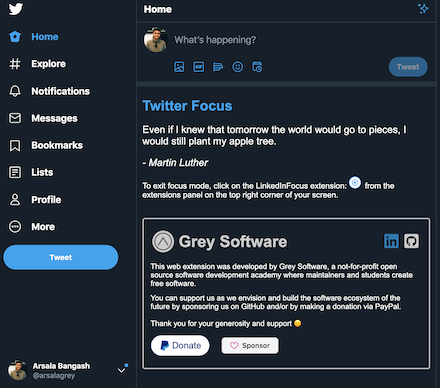
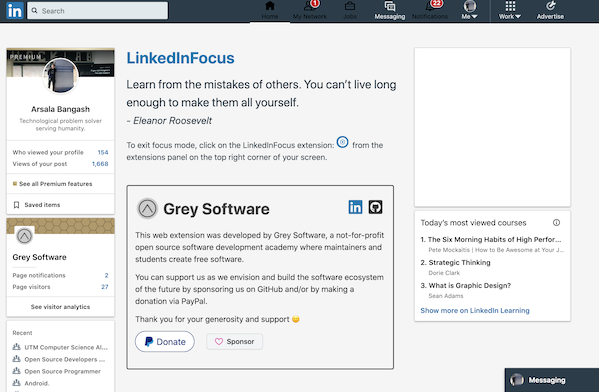
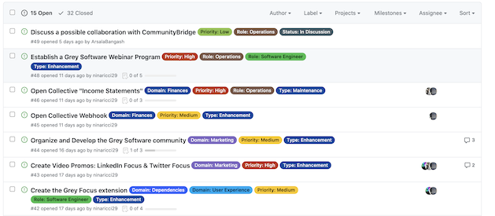

# This Week in Grey Software 2020-09-14

We deployed important fixes and enhancements for our focus extensions, and improved our Github project management processes by integrating label-sync!

## Dark mode on Twitter Focus

[Avi](https://github.com/daveavi) Fixed an issue on Twitter Focus where the dark and dim modes caused issues with viewing the quote and donations card. 

The fix is live on the Chrome and Mozilla web extension stores!

## LinkedIn Focus working again

[Isha](https://github.com/ishaaa-ai) deployed a fix for LinkedIn Focus after the extension stopped working because of changes LinkedIn made to their CSS classes. 

The fix is live on the Chrome and Mozilla web extension stores!

## Label Sync

Our repos now use [label-sync](https://github.com/maticzav/label-sync) to manage the organization's repositories. Synchronizing labels across repositories has never been easier!

The repo's maintainer [Matic](https://github.com/maticzav) also reached out about hosting an apprentice!

