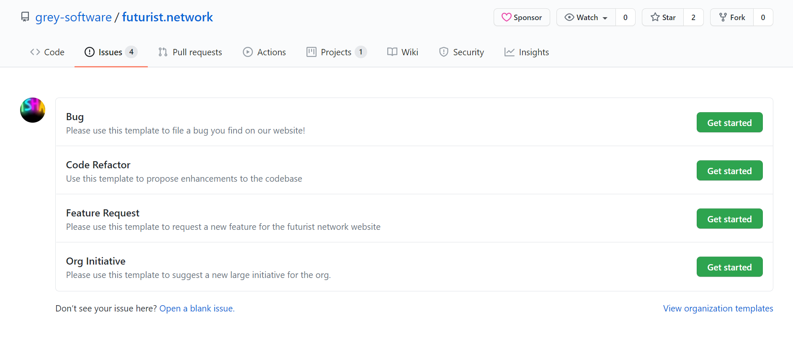
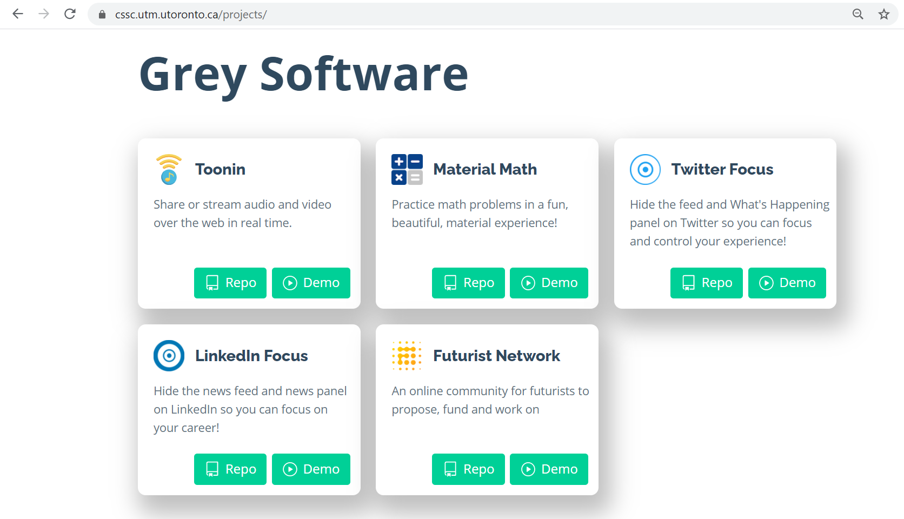

# This Week in Grey Software 2020-10-05

## Collaborating with Label Sync

We met with Matic from Label Sync to discuss how onboarding students can take his open source project to the next level! We collaborated on scoping student projects to enhance his tool, such as adding a user interface to his service and providing useful default issue labels.

## Futurist Network Updates

## Onboarding external projects

## New Issues Template

We've revamped our issues template to facilitate better asynchronous communication. After clicking on a specific category of an issue, you'll find a pre-written template which makes it easier to create issues and simultaneously ensures content consistency across all issues.

## Our Projects featured on CSSC

Grey Software's projects were featured on the website of an official UTM Computer Science department initiative called the [CSSC](https://cssc.utm.utoronto.ca/projects/). UTM students can now explore our projects and reach out if they'd like to contribute!

