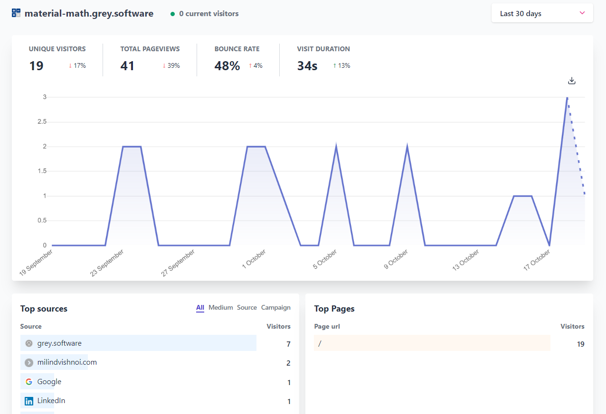
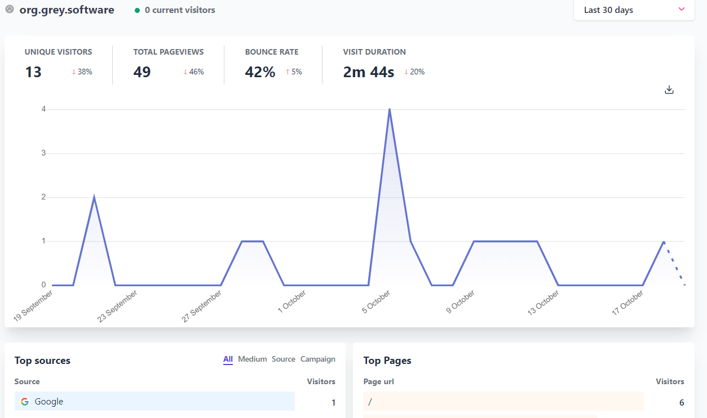

# This Week in Grey Software 2020-10-05

## Analytics in our weekly updates

We're including analytics for the first time in our weekly updates! Below are the analytics for the **grey.software**, **material-math.grey.software** and the **org website**.

### grey.software 

### material-math.grey.software

### org.grey.software

## Success Story

Osama, one of the core team members of Grey Software received an internship opportunity at [Flinks](https://flinks.io/). His success story can be found [here](https://grey.software/success-stories).

## New Initiatives

A new report card initiative was proposed. More details can be found [here](https://github.com/grey-software/org/issues/53).

## Material-Math

Arsala met with an experienced education advisor to discuss developing the MVP for Material Math that can be deployed at schools in Pakistan.

## Onboarding

Two external projects were onboarded this week from MiguelRAvila. They can be found [here](https://github.com/MiguelRAvila/Bento) and [here]( https://github.com/MiguelRAvila/SimplerentFox).

## Toonin

Toonin is down at the moment and we're working on bringing it back up by next week.
