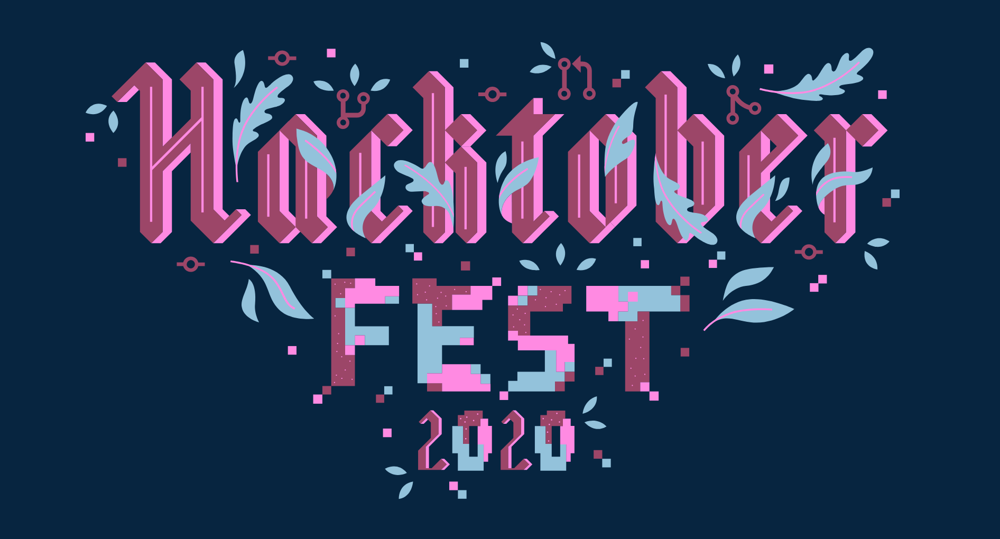
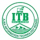
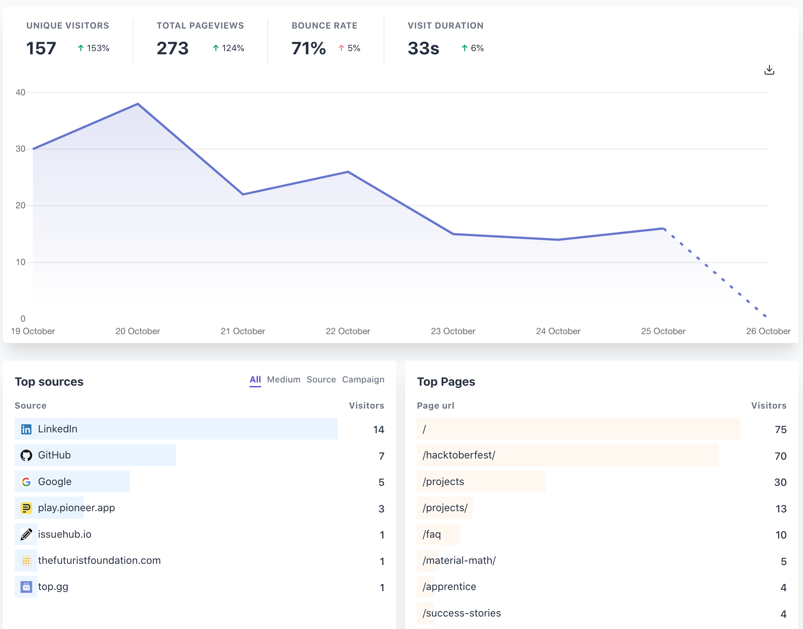
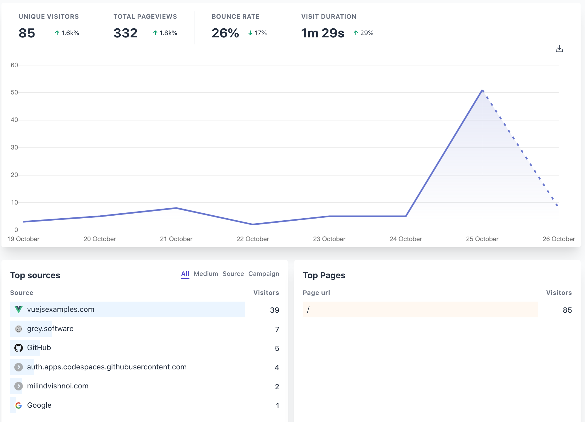

# This Week in Grey Software 2020-10-26

## A great start to Hacktoberfest

[Grey Software's Hacktoberfest initiative](https://grey.software/hacktoberfest)
produced great results for the org, inviting many external collaborators and
community members.

Our discord community grew by 20 members, and we reviewed PRs submitted by 5
external collaborators.

## Collaborating with Pakistan's AJK province's IT Board

Grey Software's founder Arsala visited the
[IT Board for Pakistan's AJK province](https://itb.ajk.gov.pk/), and discussed
how the government could adopt open-source best practices to improve their
development operations and invite passionate citizens to contirbute.

## A new org vision

After Arsala's visit to the AJK IT board where he recognized the need for
developing and promoting open-source software in government institutions, we
came up with a new vision for the organization:

_Grey Software is not for profit organization that develops and promotes
open-source software for government and education institutions._

## Onboarding Physics Hub

## Analytics

Our weekly analytics showed promising growth in our website and Material Math.

### Grey Software Website

### Material Math

